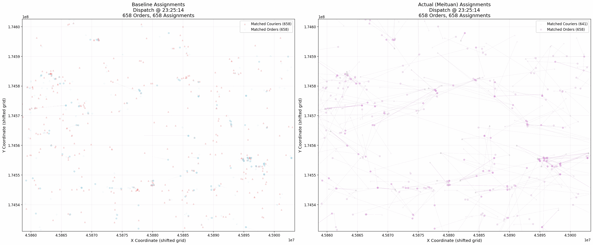
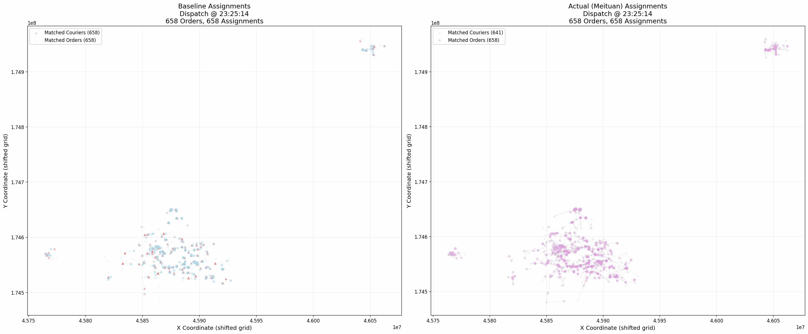
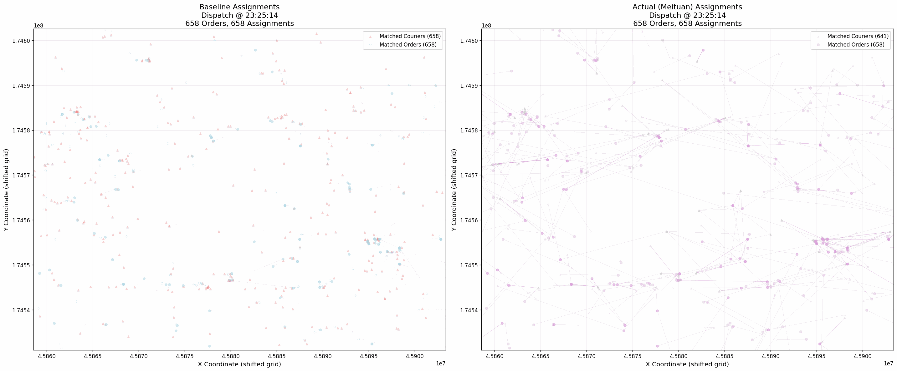

# On-Demand Food Delivery (Meituan)

Batch-based food delivery dispatch simulation using real-world operational data from Meituan/INFORMS TSL Challenge.

## Dataset Attribution

Data provided by Meituan for INFORMS Transportation Science and Logistics (TSL) Data-Driven Research Challenge.

**Dataset**: Meituan (March 2024), 654K orders, 24 dispatch cycles
**Source**: https://github.com/meituan/meituan_informs_data
**License**: CC BY-NC 4.0 (Academic use only)
**Citation**: "This research was supported by data provided by Meituan."

---

## Repository Structure

```
meituan/
├── data/                           # Raw Meituan dataset (INFORMS challenge)
├── eda/                            # Exploratory data analysis
├── context/                        # Research papers
├── visualizations/                 # Model comparison GIFs
├── models/                         # Assignment algorithms and simulation
│   ├── cost/                       # Cost function modules
│   ├── simulator/                  # Stateful batch-dispatch framework
│   ├── evaluation/                 # Analysis scripts
│   ├── visualization/              # GIF generation tools
│   ├── logs/                       # Execution logs and outputs
│   ├── 01_tier1_bipartite_distance_to_pickup.py
│   ├── 02_tier2_batch_vrp_distance_to_pickup.py
│   ├── 03_tier3_online_greedy_distance_to_pickup.py
│   └── README.md
└── README.md
```

---

## Problem

Discrete-time batch dispatch for on-demand delivery:
- Orders arrive continuously, dispatched in batches every 120-180s
- Platform must assign waiting orders to available couriers
- Stateful simulation: couriers become busy after assignment
- Objectives: minimize platform cost, customer wait, courier idle time

---

## Assignment Models

| Model | Algorithm | Assignment Type | Cost Function | Strategy | File |
|-------|-----------|----------------|---------------|----------|------|
| **01** | Hungarian (Bipartite) | One-to-One | Distance to pickup | Optimal one-to-one matching | `01_tier1_bipartite_distance_to_pickup.py` |
| **02** | K-Means + Bundling | Many-to-One | Distance to cluster centroid | Geographic clustering with multi-order routes | `02_tier2_batch_vrp_distance_to_pickup.py` |
| **03** | Greedy FCFS | One-to-One | Distance to pickup | Nearest-neighbor, no optimization | `03_tier3_online_greedy_distance_to_pickup.py` |
| **Reality** | Meituan Production | Unknown | Unknown | Historical benchmark from dataset | N/A (ground truth) |

---

## Visual Comparison

Side-by-side animated comparisons (24 dispatch cycles, 2.5s per frame):

### Model 01: Greedy Bipartite


### Model 02: Batch VRP (Fixed with Realistic Bundle Sizes)


### Model 03: Online Greedy


**Legend**: Blue circles (orders), red/gray triangles (couriers), lines (assignments). Left panel shows model assignments, right panel shows Meituan's actual assignments.

---

## Technical Details

### Simulation Framework
- **Stateful**: Tracks courier availability over time
- **Discrete-time**: Batch dispatch every 120-180 seconds
- **Physics constants** (calibrated from data):
  - Task duration: 1451s (24.2 min)
  - Rejection probability: 0.1311 (13.11%)

### Cost Function Architecture
Pluggable cost function system (`models/cost/`):
- `BaseCostFunction`: Abstract interface
- `DistanceToPickup`: Euclidean distance (current)
- Extensible for time-based, detour, or hybrid costs

### Data Pipeline
1. Load CSVs (dispatch events, courier availability, waybills)
2. Initialize courier states
3. For each dispatch cycle:
   - Get waiting orders and available couriers
   - Run assignment algorithm
   - Simulate acceptance/rejection
   - Update courier state (busy until task completion)
4. Log: assignments, cycle summaries, courier timelines
5. Generate visualizations

---

## References

- Tafreshian, A., Masoud, N., & Yin, Y. (2020). Frontiers in service science: Ride matching for peer-to-peer ride sharing: A review and future directions. *Service Science*.
- Neural Computing and Applications (2023). Dynamic vehicle routing optimization.
- Transportation Research Part B (2018). Methodological advances in ride-sharing systems.
- OR Spectrum (2020). Optimization models for on-demand delivery services.