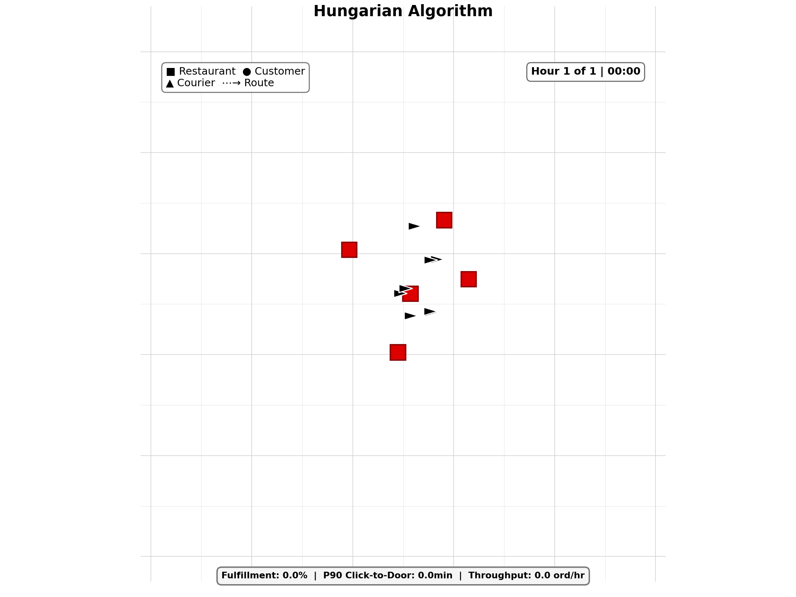
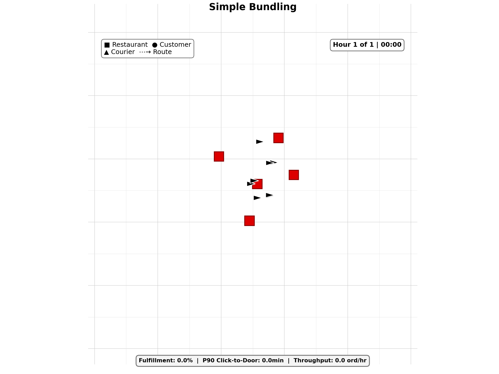
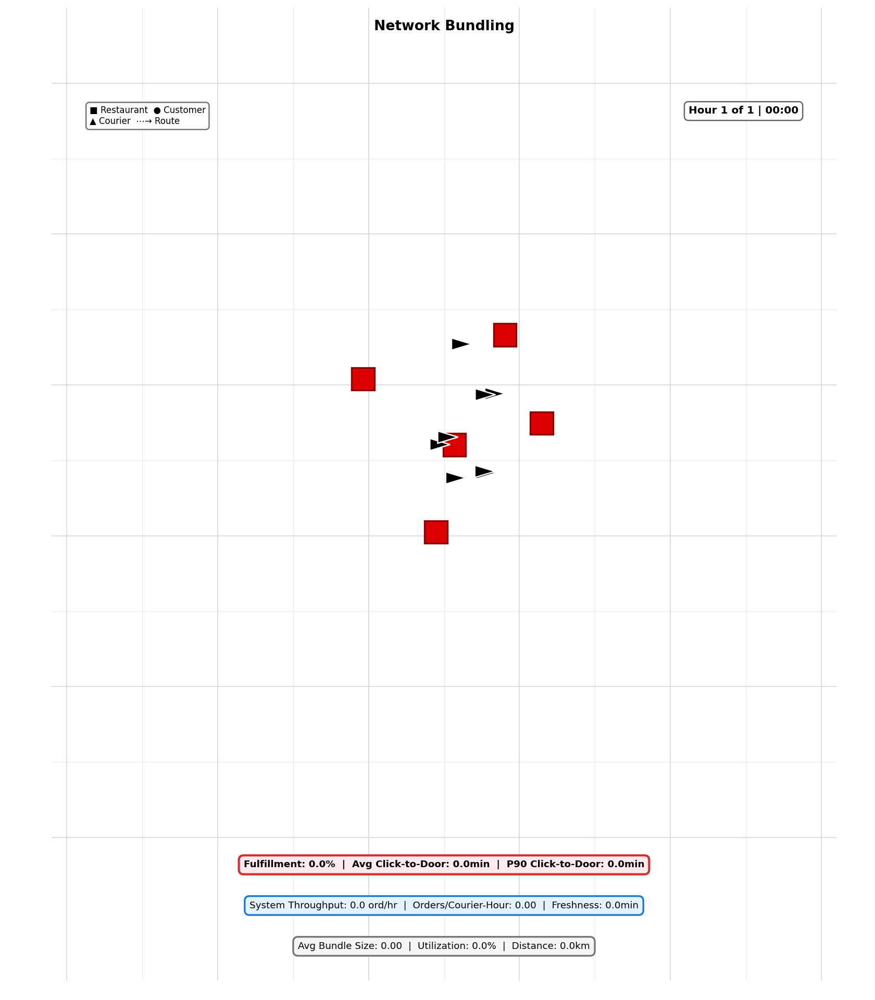
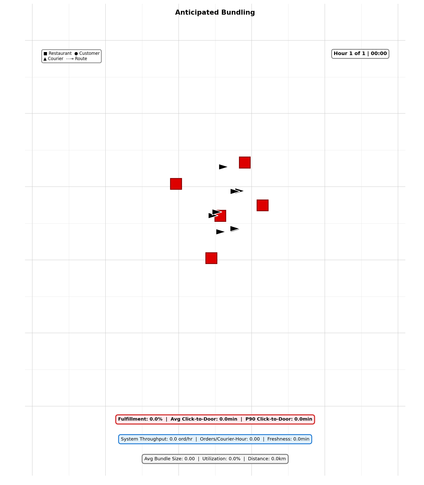

# Food Delivery Dispatch Optimization Simulator

A simulation framework for testing and comparing five food delivery dispatch algorithms.

## Overview

This simulator models a food delivery system where orders arrive over time and are assigned to couriers in discrete 5-minute batches. Five assignment algorithms are implemented and tested on identical scenarios.

**Algorithms:**
1. Greedy Assignment
2. Hungarian Algorithm (1-to-1 matching)
3. Simple Bundling (same-restaurant bundles)
4. Network Bundling (multi-restaurant bundles)
5. Anticipated Bundling (lookahead optimization)

---

## Algorithms

All algorithms use Google OR-Tools CP-SAT solver with multi-pass lexicographic optimization.

### 1. Greedy Assignment

**Description:**
Orders are processed sequentially by ready time. For each order, the algorithm selects the available courier with minimum Manhattan distance to the restaurant, subject to deadline feasibility.

**Decision Process:**
```
For each order o (sorted by ready_time):
  feasible_couriers = {c : finish_time(c,o) ≤ ready_time(o) + expiration_time}
  c* = argmin_{c ∈ feasible_couriers} d_manhattan(c.location, o.restaurant)
  Assign o to c*
```

**Finish Time:**
```math
t_{finish} = t_{current} + t_{travel\_to\_pickup} + t_{pickup\_service} + t_{travel\_to\_dropoff} + t_{dropoff\_service}
```

**Distance:**
```math
d_{manhattan}(p_1, p_2) = |x_1 - x_2| + |y_1 - y_2|
```

**Constraints:**
- One order per courier
- Deadline: $t_{finish} \leq t_{ready} + 30$ min

**Complexity:** $O(|O| \times |C|)$

---

### 2. Hungarian Algorithm

**Description:**
Optimal 1-to-1 bipartite matching between couriers and orders using three-pass lexicographic optimization.

**Decision Variables:**
```math
x_{ij} \in \{0,1\}
```
Binary variable: courier $i$ assigned to order $j$

**Optimization Passes:**

**Pass 1: Maximize assignments**
```math
\max \sum_{(i,j) \in E} x_{ij}
```

**Pass 2: Minimize pickup time** (fixing cardinality)
```math
\min \sum_{(i,j) \in E} c_{ij} \cdot x_{ij}
```
where $c_{ij}$ = Manhattan travel time from courier $i$ to restaurant of order $j$ (seconds)

**Pass 3: Tie-breaking** (fixing cardinality and pickup time)
```math
\min \sum_{(i,j) \in E} w_{ij} \cdot x_{ij}
```
where $w_{ij} = i \times 10^6 + j$ (courier and order IDs)

**Constraints:**
```math
\sum_j x_{ij} \leq 1 \quad \forall i \in C
```
```math
\sum_i x_{ij} \leq 1 \quad \forall j \in O
```
```math
E = \{(i,j) : t_{finish}(i,j) \leq t_{ready,j} + 30 \text{ min}\}
```

**Solver:** CP-SAT

---

### 3. Simple Bundling

**Description:**
Couriers can serve bundles of up to 3 orders from the same restaurant. Uses four-pass lexicographic optimization.

**Decision Variables:**
```math
x_{ij} \in \{0,1\}
```
Binary variable: courier $i$ assigned to bundle $j$

```math
y_i \in \{0,1\}
```
Binary variable: courier $i$ is used

**Bundle Generation:**
- Singles: each individual order
- Pairs: any 2 orders from same restaurant
- Triplets: any 3 orders from same restaurant

**Bundle Constraints:**
- $|B_j| \leq 3$
- All orders in $B_j$ from same restaurant
- All orders ready and deliverable before expiration

**Optimization Passes:**

**Pass 1: Maximize orders**
```math
\max \sum_{i,j} |B_j| \cdot x_{ij}
```

**Pass 2: Minimize time** (fixing orders)
```math
\min \sum_{i,j} t_{ij} \cdot x_{ij}
```
where $t_{ij}$ = total route duration for courier $i$ serving bundle $j$

**Pass 3: Minimize couriers** (fixing orders + time)
```math
\min \sum_i y_i
```
```math
\text{subject to: } y_i \geq x_{ij} \quad \forall i,j
```

**Pass 4: Tie-breaking**
```math
\min \sum_{i,j} w_{ij} \cdot x_{ij}
```
where $w_{ij} = i \times 10^{12} + j$ (courier and bundle IDs)

**Assignment Constraints:**
```math
\sum_j x_{ij} \leq 1 \quad \forall i
```
```math
\sum_{i,j : o \in B_j} x_{ij} \leq 1 \quad \forall o
```

**Route Duration:**
For bundle $B = \{o_1, \ldots, o_k\}$ from restaurant $r$:
```math
t_{route} = t_{travel}(c, r) + t_{pickup} + \min_{\sigma \in S_k} \left[ \sum_{i=0}^{k} t_{travel}(loc_i, loc_{i+1}) \right] + k \cdot t_{dropoff}
```
Delivery sequence optimized via exact TSP ($k \leq 3$)

---

### 4. Network Bundling

**Description:**
Extends Simple Bundling to allow bundles from up to 2 different restaurants. Uses same four-pass optimization structure.

**Decision Variables:** Same as Simple Bundling ($x_{ij}$, $y_i$)

**Bundle Generation:**
- Singles
- Pairs/triplets with $|R(B)| \leq 2$ where $R(B)$ = set of unique restaurants in bundle $B$
- For batches >25 orders: geographic clustering applied before bundle generation

**Route Phases:**

**Phase 1: Pickup sequence**
```math
\sigma_R^* = \arg\min_{\sigma \in S_{|R(B)|}} \sum_{i=0}^{|R(B)|} t_{travel}(loc_i, loc_{i+1})
```
TSP over restaurants

**Phase 2: Delivery sequence**
```math
\sigma_D^* = \arg\min_{\sigma \in S_{|B|}} \sum_{i=0}^{|B|} t_{travel}(loc_i, loc_{i+1})
```
TSP over customer locations

**Feasibility:**
- All orders ready at pickup time (no waiting)
- All deliveries complete before expiration

**Geographic Clustering (batches >25):**
1. Restaurant proximity: $d(r_1, r_2) \leq 1000m$
2. Customer proximity: $d(c_1, c_2) \leq 2000m$
3. Filter: $|R(B)| \leq 2$

---

### 5. Anticipated Bundling

**Description:**
Same-restaurant bundling with lookahead window. Considers PENDING orders (not yet ready) within 5-minute window. Allows courier waiting at restaurants.

**Decision Variables:** Same as Simple Bundling ($x_{ij}$, $y_i$)

**Order Pool:**
```math
P(t) = \{o : o.state \in \{PENDING, READY\} \land t_{ready} \leq t + W\}
```
where $W = 300s$ (5-minute lookahead)

**Bundle Generation:** Same as Simple Bundling (same-restaurant only), from pool $P(t)$

**Optimization:** Same four-pass structure as Simple Bundling

**Waiting:**
Couriers may wait at restaurants for pending orders:
```math
w_{total} = \sum_{r \in R(B)} \max(0, t^{max}_{ready,r} - t_{arrival,r}) \leq 300s
```

**Constraints:**
- $w_{total} \leq 5$ min
- $|R(B)| = 1$ (same-restaurant only)
- All deliveries before expiration

---

## Performance Metrics

### Customer Metrics

**Fulfillment Rate:**
```math
\frac{|D|}{|O| - |O_{out\_of\_scope}|} \times 100\%
```
where $D$ = delivered orders, $O_{out\_of\_scope}$ = orders with $t_{ready}$ > simulation duration

**Average Click-to-Door Time:**
```math
\frac{1}{|D|} \sum_{o \in D} (t_{delivered} - t_{placed})
```

**P90 Click-to-Door Time:**
90th percentile of delivery times

**Average Ready-to-Door Time:**
```math
\frac{1}{|D|} \sum_{o \in D} (t_{delivered} - t_{ready})
```

### Courier Metrics

**Utilization:**
```math
\frac{T_{total} - T_{idle}}{T_{total}} \times 100\%
```
where $T_{total} = |C| \times t_{duration}$

**Total Distance:**
```math
\sum_{c \in C} \sum_{legs} d_{manhattan}(loc_i, loc_{i+1})
```

**Orders Per Courier Hour:**
```math
\frac{|D|}{T_{total} / 3600}
```

### Platform Metrics

**System Throughput:**
```math
\frac{|D|}{t_{duration} / 3600}
```

**Average Bundle Size:**
```math
\frac{\sum_{b} |b|}{|bundles|}
```

---

## Test Results

**Scenario:** 60 orders, 8 couriers, 1 hour, 5 restaurants, Poisson arrival (λ = 1/min)

### Customer & Order Metrics

| Algorithm | Fulfillment Rate | Orders Delivered | Orders Expired | Avg Delivery Time | P90 Delivery Time | Avg Ready-to-Door |
|-----------|-----------------|------------------|----------------|-------------------|-------------------|-------------------|
| Greedy | 53.3% | 32/60 | 9 | 23.6 min | 32.1 min | 18.6 min |
| Hungarian | 55.0% | 33/60 | 14 | 20.5 min | 28.8 min | 15.5 min |
| Simple Bundling | 71.7% | 43/60 | 6 | 19.6 min | 27.3 min | 14.6 min |
| Network Bundling | 76.7% | 46/60 | 5 | 22.1 min | 30.5 min | 17.1 min |
| Anticipated Bundling | 83.3% | 50/60 | 6 | 18.7 min | 30.8 min | 13.7 min |

### Operational & Efficiency Metrics

| Algorithm | Bundles Created | Avg Bundle Size | Courier Utilization | Orders per Courier-Hour | Total Distance | Distance per Order | System Throughput | Algorithm Runtime |
|-----------|----------------|-----------------|---------------------|------------------------|----------------|-------------------|-------------------|-------------------|
| Greedy | 0 | - | 81.7% | 4.00 | 110.8 km | 3.46 km | 32.0/hr | 0.1s |
| Hungarian | 0 | - | 82.3% | 4.12 | 112.8 km | 3.42 km | 33.0/hr | 0.3s |
| Simple Bundling | 14 | 2.64 | 81.8% | 5.38 | 106.8 km | 2.48 km | 43.0/hr | 0.4s |
| Network Bundling | 15 | 2.80 | 84.7% | 5.75 | 102.3 km | 2.22 km | 46.0/hr | 1.1s |
| Anticipated Bundling | 17 | 2.59 | 81.1% | 6.25 | 114.4 km | 2.29 km | 50.0/hr | 0.8s |

Total runtime: 2.7 seconds

---

## Visual Comparison

### 1. Greedy Assignment


### 2. Hungarian Algorithm


### 3. Simple Bundling


### 4. Network Bundling


### 5. Anticipated Bundling


Legend: ■ Restaurant (red) ● Customer (blue) ▲ Courier (black) ⋯→ Route (colored)

---

## System Parameters

**Physics:**
- Map: $5000m \times 5000m$
- Courier speed: $v = 30$ km/h $= 8.33$ m/s
- Travel time: $t = \frac{d_{manhattan} \times 1000}{v}$ (seconds)
- Pickup service: $t_{pickup} = 90s$
- Dropoff service: $t_{dropoff} = 45s$
- Meal prep: $t_{prep} = 300s$
- Order expiration: $30$ min
- Batch interval: $300s$

**Algorithm Parameters:**
- Max bundle size: $3$
- Lookahead window: $300s$
- Max wait time: $300s$

---

## Quick Start

```bash
python3 test_all_algorithms.py
```

Runtime: ~3 seconds

---

## Repository Structure

```
meituan/
├── test_all_algorithms.py
├── simulator_core.py
├── assignment_algorithms.py
├── config_loader.py
├── distance_metrics.py
├── scenarios/
│   └── quick_test.yaml
├── scenario_generators/
│   ├── scenario_factory.py
│   ├── layout_generators.py
│   └── demand_generators.py
└── outputs/
```

